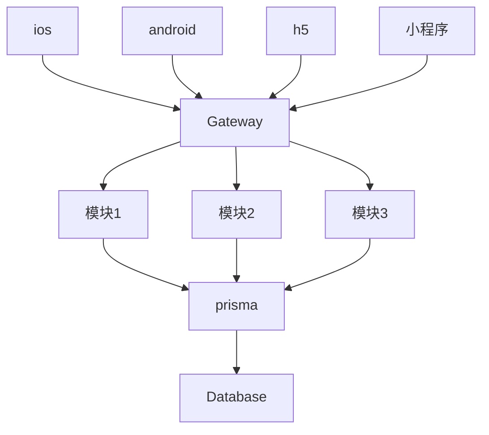
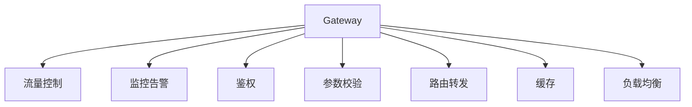

## 业务逻辑

```mermaid
graph TD;
    ios-->Gateway;
    android-->Gateway;
    h5-->Gateway;
    小程序-->Gateway;
    Gateway-->模块1;
    Gateway-->模块2;
    Gateway-->模块3;
    模块1-->prisma;
    模块2-->prisma;
    模块3-->prisma;
    prisma-->Database;
```

## Gateway

```mermaid
graph TD;
    Gateway-->流量控制;
    Gateway-->监控告警;
    Gateway-->鉴权;
    Gateway-->参数校验;
    Gateway-->路由转发;
    Gateway-->缓存;
    Gateway-->负载均衡;
```

## 开发计划

- [ ] 底层

