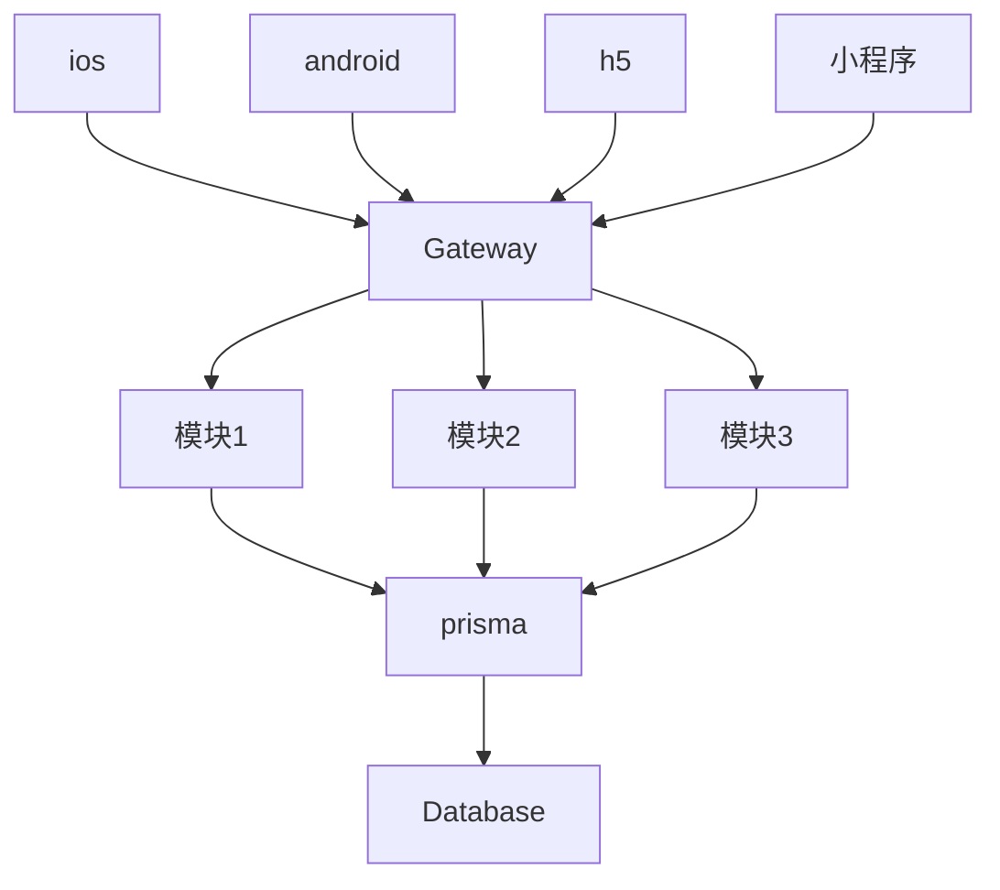
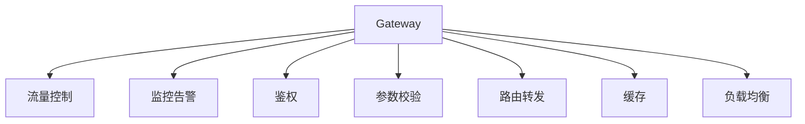

## 业务逻辑

## Gateway

## 开发计划

- [x] 系统安全管理平台
  - [ ] 数据库审计
  - [ ] 准入管理
  - [ ] 漏洞扫描
  - [ ] 终端安全管理
  - [ ] 病毒防护
- [ ] 基础信息管理平台
  - [ ] 数据字典
  - [ ] 用户与角色管理
  - [ ] 人员信息管理
  - [ ] 设备信息管理
- [ ] 可视化应用平台
  - [ ] 基础功能
    - [ ] 可视化设计
    - [ ] 可视化模板
    - [ ] 数据源管理
    - [ ] 可视化页面制作
      - [ ] 页面设置
      - [ ] 常规图标
      - [ ] 地图
      - [ ] 文字
      - [ ] 辅助图形
  - [ ] 应用展示
    - [ ] 全局指挥
    - [ ] 勤务管理
    - [ ] 预案部署
    - [ ] 警情监控
    - [ ] 事件研判
- [ ] 决策分析平台
  - [ ] 公众服务系统
    - [ ] 交通运行指数
    - [ ] 精细化的实时路况发布
    - [ ] 未来路况预测及发布
    - [ ] 历史数据分析
    - [ ] 宏观分析
    - [ ] 微观分析
  - [ ] 指挥中心系统
    - [ ] 交通运行指数
    - [ ] 历史数据分析
    - [ ] 指标类比分析
    - [ ] 拥堵扩散分析
    - [ ] 交通诱导服务
    - [ ] 交通违法态势研判
    - [ ] 交通事故态势研判
- [x] 综合运维平台
  - [ ] 机房运维
    - [ ] 动环
    - [ ] 数据库
    - [ ] 软件系统运维
  - [ ] 网络运维
    - [ ] 节点运维
    - [ ] 负载运维
    - [ ] 交换机状态监控
  - [ ] 设备运维
    - [ ] 视频质量诊断
    - [ ] 视频质量诊断
    - [ ] 报修流程
    - [ ] 报修流程
- [ ] 公众服务平台
  - [ ] 互联网交通安全综合服务
    - [ ] 用户信息
    - [ ] 交管动态
    - [ ] 业务办理
    - [ ] 服务地图
    - [ ] 公告公布
    - [ ] 信息查询
    - [ ] 信息查询
    - [ ] 警示教育
  - [ ] 城市交通信息服务
    - [ ] 信息公开
    - [ ] 交通出行
    - [ ] 便民服务
    - [ ] 便民服务
- [x] 交通安全管理平台 待定
  - [ ] 交通安全应急响应
    - [ ] 前端事故信息采集
    - [ ] 交通异常状态监测
    - [ ] 救援方案生成
    - [ ] 辅助决策
    - [ ] 诱导信息发布
  - [ ] 交通事故仿真与再现
  - [ ] 交通安全数据搜集与分析
    - [ ] 历史事故信息分析
    - [ ] 事故多发点鉴别与交通安全评价
    - [ ] 道路交通事故对比
    - [ ] 事故多发地点段排查
    - [ ] 事故预警
    - [ ] 事故趋势分析
    - [ ] 管理维护地图数据与属性数据
    - [ ] 系统信息管理
  - [ ] 交通安全数据搜集与分析
    - [ ] GIS应用
    - [ ] 黑点信息管理
    - [ ] 黑点判定预测
- [x] 视频综合管控中心平台
  - [ ] 实时监控
    - [ ] 多画面预览
    - [ ] 实时抓图
    - [ ] 云台控制
  - [ ] 录像回放
    - [ ] 录像检索
    - [ ] 录像回放
    - [ ] 录像下载
  - [ ] 视频上墙
    - [ ] 电视墙预案管理
    - [ ] 上墙控制
  - [ ] 轮巡任务
    - [ ] 轮巡设置
    - [ ] 轮巡预案管理
  - [ ] 浓缩摘要
    - [ ] 任务管理
    - [ ] 摘要播放
    - [ ] 目标检索
  - [ ] 视频结构化
    - [ ] 任务管理
    - [ ] 结构化播放
    - [ ] 目标检索
  - [ ] 事件检测
    - [ ] 实时监测
    - [ ] 事件管理
    - [ ] 报警管理
  - [ ] AR立体防控
    - [ ] 资源展示
    - [ ] 画中画
    - [ ] 视频地图
    - [ ] 高点视频巡检
    - [ ] 警力定位调度
    - [ ] 报警信息展示
- [x] 区域信号控制平台 待定
  - [ ] 信号控制系统
    - [ ] 信号控制
    - [ ] 预案设置
    - [ ] 报表统计
    - [ ] 状态监控
    - [ ] GIS应用
    - [ ] 系统管理
  - [ ] 地磁中心应用系统
    - [ ] 流量采集
    - [ ] 统计分析
  - [ ] 公交优先控制
    - [ ] 策略管理
    - [ ] 通行状态管理
    - [ ] 信息统计
- [x] 车辆管控平台
  - [ ] 车辆布控
  - [ ] 交通流管理
  - [ ] 违法数据管理
  - [ ] 车辆检索
  - [ ] 技战法
  - [ ] GIS应用
  - [ ] 以图搜图
  - [ ] 手动违法抓拍
- [ ] 集成指挥平台
  - [ ] 扁平化指挥调度系统
    - [ ] 警情管理
      - [ ] 接处警管理
      - [ ] 社会事件报警管理
      - [ ] 事件标注
    - [ ] 可视化派警
    - [ ] 警员执勤状态查询
    - [ ] 应急预案
    - [ ] 研判分析
  - [ ] 勤务管理系统
  - [ ] 特勤保障
  - [ ] 预案管理
  - [ ] 综合态势
  - [ ] 专题
  - [ ] 交通信息解析
  - [ ] 警情热点研判
  - [ ] 数据综合分析
  - [ ] 缉查布控
  - [ ] 信息发布
  - [ ] 占道施工管理
  - [ ] 通行证管理
  - [ ] 统计分析